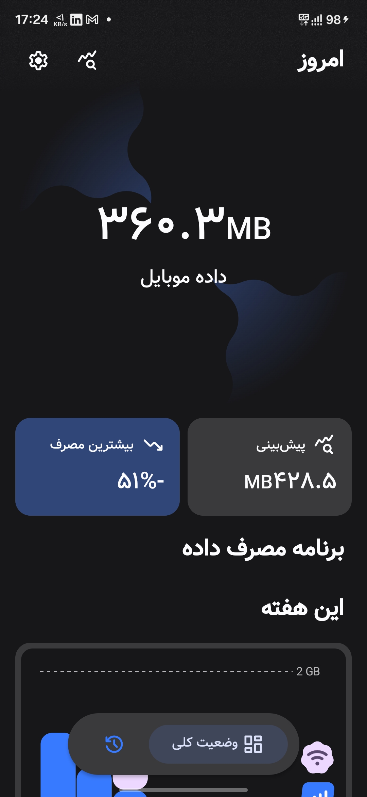
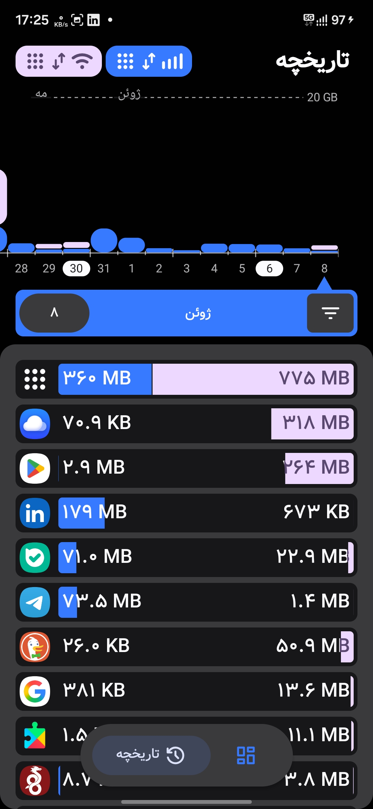
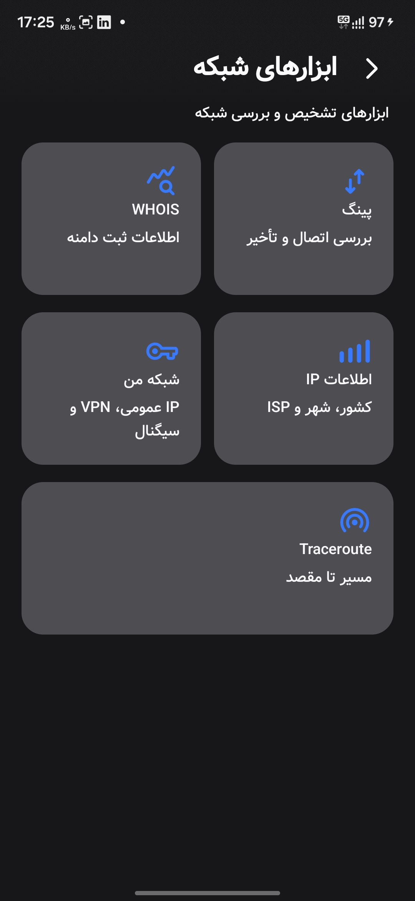
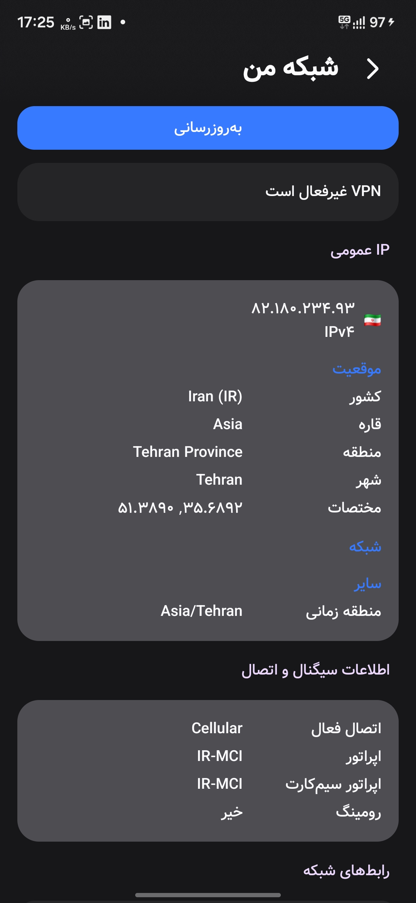

# NetBan
NetBan is an open-source tool for tracking your network usage while ensuring total privacy. Inspired by [Traffic Light](https://github.com/leekleak/traffic-light).

## Features
- Data plan tracking (including multiple SIMs)
- Status bar network indicator
- In-depth historical data tracking
- At a glance usage analytics
- Fast and modern with a stunning design
- Network utility like ping, traceroute etc

## Screenshots

  
  
  
  

## Feedback

You can create github issue for feature request, my main focus is adding more network utilities.